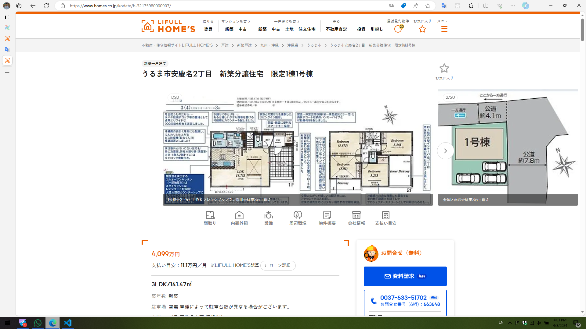

# Hihi

## Check existing connection

If you're create connections using environment variables. The connections won't be shown in UI or `airflow connections list` command. You can check the connection by using `airflow connections get {conn_id}`

| Format Type | URL                                                              | Distinction                                                                                                                        | Snapshot                         |                                      |
| ----------- | ---------------------------------------------------------------- | ---------------------------------------------------------------------------------------------------------------------------------- | -------------------------------- | ------------------------------------ |
| Format 1    | <https://www.homes.co.jp/kodate/b-17077260002244/>               | `#contents > div.sec-detailContents.sbKodate.prg-detailContents > div.sec-contents > div.mod-summary > div > h1 > span.bukkenName` |  |                                      |
| Format 2    | <https://www.homes.co.jp/kodate/b-32175980000907/>               | `div[data-component='ArticleHeader'] h1 > span:last-child`                                                                         |  |                                      |
| Format 3    | <https://www.homes.co.jp/kodate/b-1472370003005/?force_search=1> | `#chk-bkh-name`                                                                                                                    |                                  |  |
