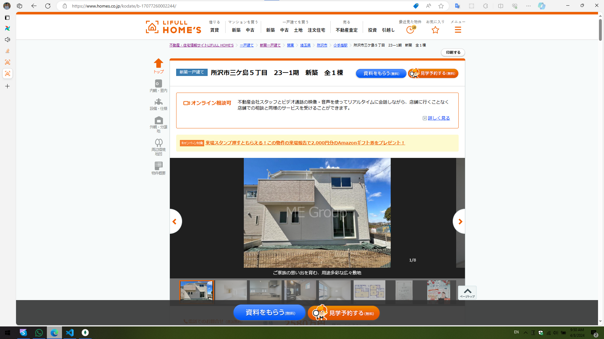

# Hihi

## Check existing connection

If you're create connections using environment variables. The connections won't be shown in UI or `airflow connections list` command. You can check the connection by using `airflow connections get {conn_id}`

| Format Type | URL                                                | Distinction          | Snapshot                     |
| ----------- | -------------------------------------------------- | -------------------- | ---------------------------- |
| Format 1    | <https://www.homes.co.jp/kodate/b-17077260002244/> | `h1 span.bukkenName` |  |
